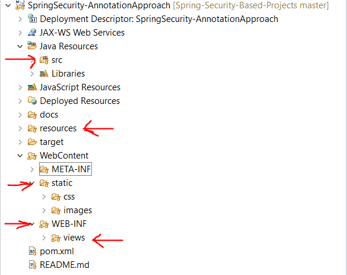

# What is the Application about ?  
&nbsp;=> This is a Spring-Security application replacing legacy web.xml by Java configuration (Annotation) approach  

# How to run the application ?  
&nbsp;=> This application needs to be run at tomcat and may get 403 when run into wild-fly server  
&nbsp;=> Open project in eclipse => Right click into a <strong>resources</strong> folder => build path => use as a Source Folder  
&nbsp;=> Right click on a project => Maven => update-project 
&nbsp;=> Right click on a project => run as => Run on server => run  
&nbsp;=> You can now browse the application at http://localhost:8080/SpringSecurity-AnnotationApproach/  
&nbsp;=> In case of 404, make sure to change the JarfileName in a web-project setting which sometime may not update 
&nbsp;=> You may get 500 error saying the css code not found.If that happens, the project structure might be like below:  
&nbsp;&nbsp;&nbsp;&nbsp;&nbsp;&nbsp;&nbsp;&nbsp;&nbsp;&nbsp;&nbsp;&nbsp;&nbsp;&nbsp;&nbsp;&nbsp;&nbsp;&nbsp;&nbsp;&nbsp;
                
              
&nbsp;=> Normally when you clone a fresh copy from Git, the structure might be like above where the resources folder is not in a class path. So that in this
condition, you need to create a new <strong>source folder</strong> inside <strong>java Resources</strong> parallel to src like below which automatically brings
the files inside it the classpath:  
&nbsp;&nbsp;&nbsp;&nbsp;&nbsp;&nbsp;&nbsp;&nbsp;&nbsp;&nbsp;&nbsp;&nbsp;&nbsp;&nbsp;&nbsp;&nbsp;&nbsp;&nbsp;&nbsp;&nbsp;
                